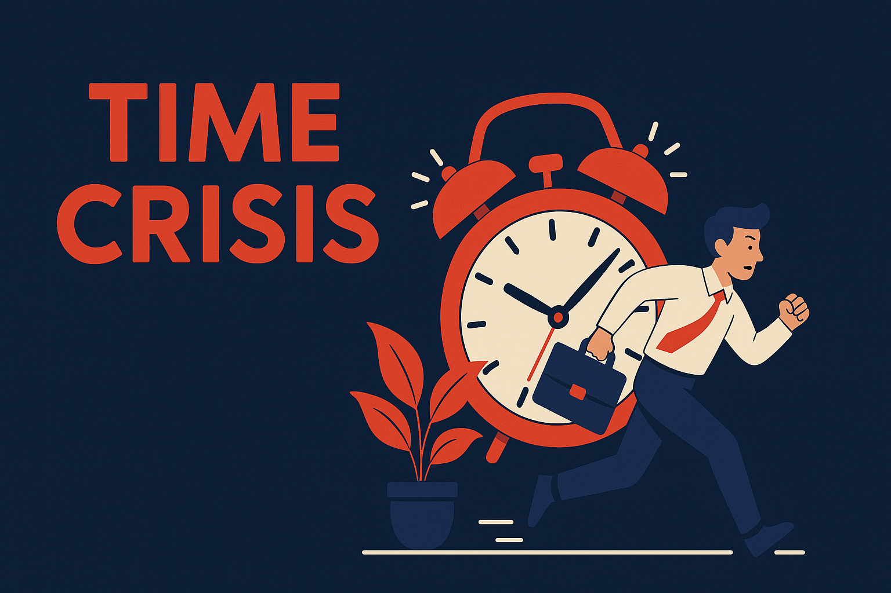

# Time Crisis

A sleek, mission-critical time tracking application with a modern, action-oriented interface. Time Crisis helps you track your activities with style and urgency.

🌐 **Start tracking your time now!** [https://rodreegez.github.io/time-crisis/](https://rodreegez.github.io/time-crisis/)

## Features

- 🎯 Real-time activity logging
- 🔄 Edit existing activities
- 💾 Local storage persistence
- 🎨 Modern, responsive design
- ⚡ Smooth animations and transitions
- 🌙 Dark theme with high contrast
- 📱 Mobile-friendly interface

## How to Use

1. Open `index.html` in your web browser
2. Enter your activity in the input field
3. Click "Log Mission" to save your activity
4. View your logged activities below
5. Edit any activity by clicking the "Edit" button

## Technical Details

Time Crisis is built with vanilla JavaScript and uses:
- Local Storage for data persistence
- Modern CSS features including:
  - Flexbox for layout
  - CSS Grid for structure
  - CSS Animations for interactivity
  - Glass-morphism effects
  - Responsive design principles

## Browser Support

Time Crisis works on all modern browsers that support:
- ES6+ JavaScript
- CSS Flexbox
- Local Storage API

## Getting Started

1. Clone this repository
2. Open `index.html` in your preferred web browser
3. Start tracking your activities!

## Contributing

Feel free to submit issues and enhancement requests!

## License

This project is open source and available under the MIT License. 